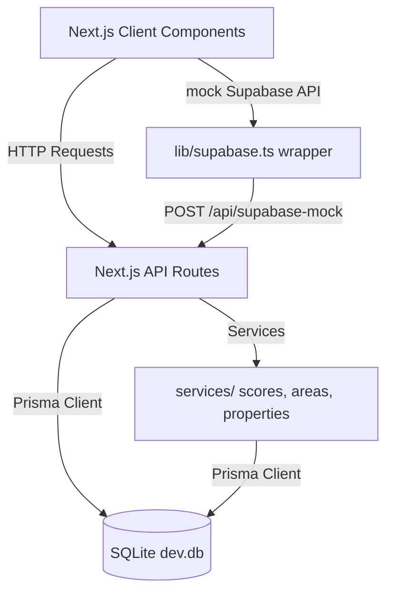

# Vi-SiT (Vision for Your Next Site)

> [!NOTE]
> **Internship Credentials:**
> - [Innovation Internship Offer Letter](https://drive.google.com/file/d/1GmcfGlk_5hcTNkn0FH2sykYOl_8SIpfk/view?usp=drivesdk)
> - [Innovation Intern Certificate](https://drive.google.com/file/d/1E8C-EbPIr1TI_CIPgAsAUdoCjW93LAhJ/view?usp=drivesdk)

Vi-SiT is a real-time, neighborhood-level livability scoring platform designed to help homebuyers, renters, and commercial developers make smarter location decisions in Hyderabad. By aggregating environmental metrics (AQI, noise), infrastructure quality (transit, road quality, utilities), and social factors (safety, amenity density), Vi-SiT produces a proprietary 0-100 score for different urban sectors.

---

## Features

- **Interactive Score Map:** Geospatial visualization of Hyderabad showing livability overlays across different zones.
- **Proprietary Visit Score Engine:** Dynamic algorithmic score updates based on real-time and ingested environmental data.
- **Comprehensive Area Profiles:** Deep dive reports for individual neighborhoods displaying pros, cons, and environmental sub-scores.
- **Property Listings Directory:** Property feeds with verified tags, owner listings, and historical score snapshots.
- **Neighborhood Discussion Hubs:** Area-specific community boards and discussion groups.
- **Admin Control Dashboard:** Interface for uploading Excel/CSV datasets, triggering score recalculations, and moderating listings.

---

## Tech Stack

- **Frontend:** Next.js (App Router, Tailwind CSS v4, Framer Motion, Recharts)
- **Backend:** Next.js API Routes (Serverless)
- **Database:** SQLite (local self-contained file database)
- **ORM:** Prisma (v6)
- **Authentication:** Custom JWT-based session tokens with HTTP-only cookies and bcrypt hashing
- **Libraries:** Lucide React, clsx, tailwind-merge, xlsx (Excel parser)
- **Tools:** Node.js, npm, Git

---

## Folder Structure

```markdown
├── app/
│   ├── (app)/
│   │   └── dashboard/      # Desktop dashboard interface
│   ├── api/
│   │   ├── auth/           # Login, signup, logout, session routes
│   │   ├── calculate-score # Ingests metrics and computes scores
│   │   ├── process-dataset # Parses CSV/Excel datasets
│   │   └── supabase-mock   # Database proxy for client-side queries
│   ├── developer/          # Admin control boards and datasets page
│   ├── login/              # Login screen
│   ├── mobile/             # Mobile-optimized pages (Explore, Map, Profile)
│   ├── signup/             # Signup screen
│   ├── globals.css         # Tailwind v4 globals
│   ├── layout.tsx          # Root layout with theme context
│   └── page.tsx            # Interactive animated landing page
├── components/             # Reusable UI components (mobile & desktop)
├── lib/
│   ├── prisma.ts           # Singleton Prisma client instance
│   ├── supabase.ts         # Client query proxy wrapper
│   └── utils.ts            # Scoring helpers and color scales
├── prisma/
│   ├── schema.prisma       # Database models schema definition
│   ├── seed.ts             # Demo data population script
│   └── migrations/         # Database migration history
├── services/               # Modular data access layer
├── types/                  # Database and common interfaces
├── proxy.ts                # Mobile viewport detector and router
└── package.json            # Configuration and dependencies
```

---

## Architecture Overview



---

## Screenshots

### Home Page
`[Animated Landing Page Screenshot]`

### Login
`[Custom Login Page Screenshot]`

### Dashboard
`[Desktop Livability Map Dashboard Screenshot]`

### Property Listings
`[Property Feed and Listings Directory Screenshot]`

### Admin Panel
`[Administrator Dataset Manager Control Board Screenshot]`

---

## Installation

### Prerequisites
- Node.js (v18 or higher)
- npm

### Setup Steps
1. Clone the repository:
   ```bash
   git clone https://github.com/srihanrajguduru/visit-app.git
   cd visit-app
   ```

2. Install dependencies:
   ```bash
   npm install
   ```

3. Initialize the SQLite database and run migrations:
   ```bash
   npx prisma migrate dev --name init
   ```

4. Populate the database with test data:
   ```bash
   npx prisma db seed
   ```

5. Launch the local development server:
   ```bash
   npm run dev
   ```
   Open `http://localhost:3000` in your browser.

---

## Environment Variables

Create a `.env.local` file in the root directory:

```env
# Google Maps Api Key (Required for maps to render)
NEXT_PUBLIC_GOOGLE_MAPS_API_KEY="AIzaSyYourKeyHere"

# Custom Session Encryption Secret
JWT_SECRET="generate-a-secure-random-signing-secret-here"
```

---

## Running the Project

- **Development:** `npm run dev`
- **Build Production:** `npm run build`
- **Start Production Server:** `npm run start`
- **Linting check:** `npm run lint`

---

## API Documentation

### 1. Authenticated User Session (`GET /api/auth/me`)
Retrieves the logged-in user profile from session cookies.
- **Headers:** `Cookie: __session=<JWT>`
- **Response:**
  ```json
  {
    "success": true,
    "user": {
      "id": "user-uuid",
      "email": "user@visit.com",
      "name": "User Name",
      "role": "user"
    }
  }
  ```

### 2. Force Visit Score Calculation (`POST /api/api/calculate-score`)
Recalculates the proprietary livability score of an area.
- **Request Body:**
  ```json
  {
    "area_id": "demo-area-1"
  }
  ```
- **Response:**
  ```json
  {
    "success": true,
    "score": 85.5
  }
  ```

### 3. Ingest Environmental Dataset (`POST /api/process-dataset`)
Parses CSV/Excel records, matches coordinates, and updates metrics.
- **Request Body:**
  ```json
  {
    "records": [
      { "Area": "Cyber City", "AQI": 42, "Noise Level": 54 }
    ]
  }
  ```
- **Response:**
  ```json
  {
    "success": true,
    "processed": 1,
    "updatedAreas": 1
  }
  ```

---

## Database Schema

- **User / UserProfile:** Login credentials, avatar URLs, and associated areas.
- **Area / AreaMetrics:** Geographic metadata (latitude/longitude) and aggregated environmental statistics (PM2.5, road quality, metro transit proximity).
- **VisitScore / VisitScoreHistory:** Historical time-series score tracking.
- **PropertyListing / PropertyMetadata / PropertyImage:** Realtor listings, verified owner status, and price history snapshots.
- **CommunityPost / CommunityComment / CommunityMember:** Forum threads, comment threads, and area association tables.
- **InfrastructureNode:** Transit terminals, fiber hubs, and roadway segments status.

---

## Future Improvements

1. **PostGIS Migration:** Move distance searches from Haversine code to true GIS indexes once deployed to production.
2. **Auto-refresh Cron:** Implement automatic daily triggers for score recalculations when new datasets arrive.
3. **Advanced Filtering:** Add pricing trend prediction lines to the property feed charts.

---

## Contributing

1. Fork the Project.
2. Create your Feature Branch (`git checkout -b feature/AmazingFeature`).
3. Commit your Changes (`git commit -m 'feat: add amazing feature'`).
4. Push to the Branch (`git push origin feature/AmazingFeature`).
5. Open a Pull Request.

---

## License

Distributed under the MIT License. See `LICENSE` for details.

---

## Author

- **GitHub:** [@srihanrajguduru](https://github.com/srihanrajguduru)
